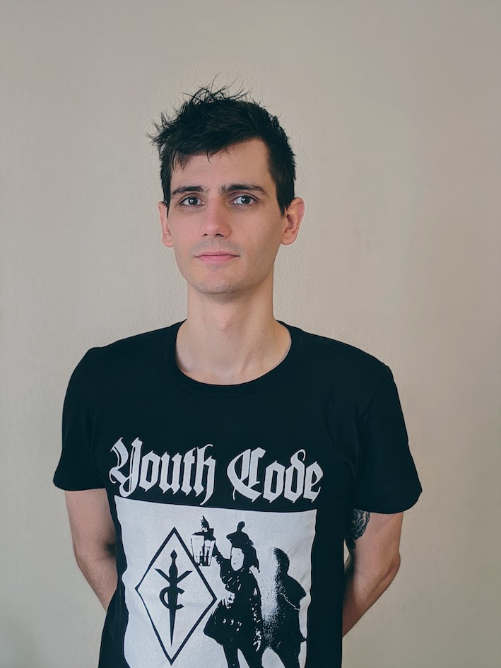

---
# Feel free to add content and custom Front Matter to this file.
# To modify the layout, see https://jekyllrb.com/docs/themes/#overriding-theme-defaults

layout: home
---

 | __Joachim Petit__    I am a PhD student at the University of Basel, supervised by [Pierre Le Boudec][Pierre].     My field of research is Number Theory.    __Contact__: joachim.petit ■ unibas.ch

| PREPRINTS |
|-----------|
| _Average rank in families of quadratic twists with a rational point of almost minimal height_   in preparation |

| PUBLICATIONS |   |
|--------------|:-:|
|  _On the number of quadratic twists with a rational point of almost minimal height_   Int. Math. Res. Not. IMRN, to appear | [arXiv][ART01-arXiv] |

[Pierre]: https://numbertheory.dmi.unibas.ch/leboudec/

[ART01-arXiv]: https://arxiv.org/abs/2004.02500
