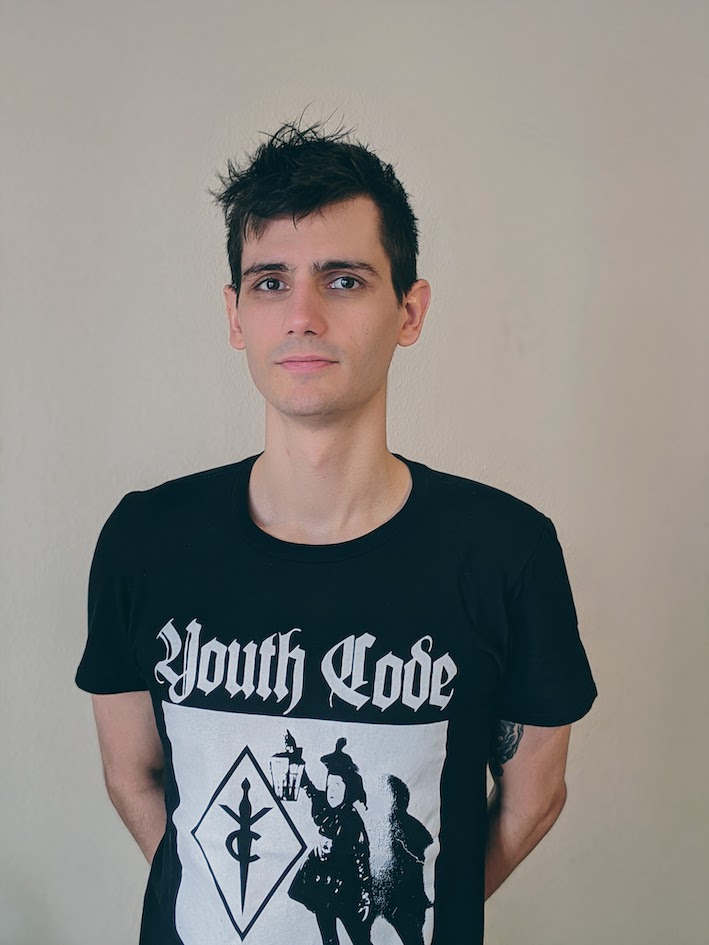

---
# Feel free to add content and custom Front Matter to this file.
# To modify the layout, see https://jekyllrb.com/docs/themes/#overriding-theme-defaults

layout: home
---

 | __Joachim Petit__    I am a PhD student at the University of Basel, supervised by [Pierre Le Boudec][Pierre].     My field of interest is Number Theory.    __Contact__: joachim.petit ■ unibas.ch

<h2>Research</h2>

* [On the number of quadratic twists with a rational point of almost minimal height][ART01]
	  _submitted_

[Pierre]: https://numbertheory.dmi.unibas.ch/leboudec/

[ART01]: https://arxiv.org/abs/2004.02500
